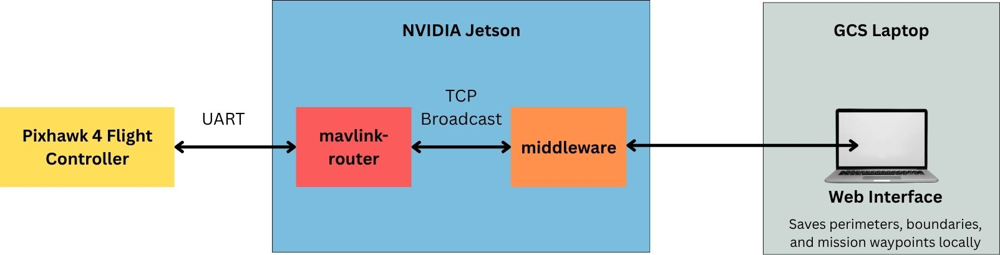

# Makara-Pleco2-GCS

Ground Control Station (GCS) dan middleware untuk **Makara Pleco II** — Autonomous Surface Vehicle (ASV) untuk survei batimetri perairan dangkal.

Dikembangkan oleh Fakultas Teknik Universitas Indonesia dalam kerangka Program Pendanaan Inovasi (PPI) UI 2025 Skema P3, bersama mitra industri PT Pustek Energi dan Teknologi.

> [!IMPORTANT]
> **Repository ini private dan tidak memuat kredensial apa pun.**
>
> Seluruh password, auth key, hostname, dan path sertifikat tercantum **hanya** pada **MKP2-LAP-001 Lampiran C — Konfigurasi Sensitif**, yang diserahkan terpisah kepada pihak berwenang saat handover.
>
> Jangan menambahkan kredensial ke repository ini — termasuk ke README, komentar kode, file `.env` yang ter-commit, atau pesan commit. Lihat [Security](#security).

---

## Versi Aplikasi Desktop
- [Unduh di sini](https://drive.google.com/file/d/1aX_f_PRMNoGYpL2J10eUM2ciMgnbisuX/view?usp=drive_link)

## Referensi Dokumentasi

| Kebutuhan | Rujukan |
|---|---|
| Kredensial, hostname, IP, path sertifikat | **MKP2-LAP-001 Lampiran C** (terbatas) |
| Prosedur operasi lapangan | MKP2-LAP-001 Bab 1–5 |
| Setup Tailscale & regenerate OAuth client | MKP2-LAP-001 Bab 4.3 + Lampiran C.2 |
| Manajemen sertifikat TLS (expiry 90 hari, cron) | MKP2-LAP-001 Bab 4.8 |
| Master pre-deployment checklist | MKP2-LAP-001 Lampiran B |
| Troubleshooting | MKP2-LAP-001 Lampiran D |
| Parameter ArduPilot | MKP2-LAP-001 Lampiran C.8 |

---

## Struktur Proyek

```
├── backend/
│   ├── middleware.py        # MAVLink ↔ JSON bridge + WebSocket server (Arch 2 / edge)
│   └── requirements.txt
├── frontend/                # Next.js 15 (App Router, static export) + Electron
│   ├── src/
│   │   ├── app/
│   │   │   ├── page.js      # Dashboard telemetri live
│   │   │   └── review/      # Review Mode — playback + interpolasi 2D/3D
│   │   ├── components/
│   │   ├── lib/
│   │   │   ├── bathyTin.js          # Interpolasi Delaunay TIN (shared 2D + 3D)
│   │   │   ├── connectionConfig.js  # Endpoint Hybrid/Offline
│   │   │   └── depthColor.js        # Pemetaan kedalaman → warna
│   │   └── t500.js          # Lookup PWM → rpm/arus/daya/gaya (T500)
│   └── electron/            # Shell desktop (wajib untuk mode Full-Offline)
└── scripts/
```

**Middleware.** `backend/middleware.py` membaca MAVLink dari flight controller melalui `mavlink-router`, menerjemahkannya ke JSON, dan menyajikannya via WebSocket. Berjalan **di atas Jetson onboard** (arsitektur edge). Middleware juga mengelola `mavlink-routerd` sebagai subprocess dan menjalankan serial watchdog yang melakukan re-detect otomatis bila FCU berpindah path setelah USB replug.

> [!NOTE]
> Versi lama README menyebut `middleware-Arch1.py` dan `middleware-Arch2.py`. Kedua file tersebut sudah **tidak ada** — middleware kini satu file (`middleware.py`) yang mengimplementasikan Arsitektur 2 (edge-based). Arsitektur 1 (middleware di sisi GCS) berstatus legacy dan hanya tersedia pada branch `Arch1-evaluator`.

---

## Arsitektur Sistem



Middleware berjalan langsung di Jetson onboard. Frontend GCS terhubung ke API middleware. Ini mengurangi penggunaan bandwidth — hanya telemetri terproses yang dikirim — dan menjaga wahana tetap otonom bila tautan ke darat terputus.

### Mode Koneksi

Frontend mendukung dua mode yang dapat dipilih operator melalui **Connection Mode Selector** di dashboard:

| | **Hybrid** (default) | **Full-Offline** |
|---|---|---|
| Endpoint | `wss://<hostname>.<tailnet>.ts.net:9000/ws` | `ws://10.10.10.3:9001/ws` |
| Jalur | Tailscale — P2P direct via Ubiquiti 5 GHz, atau DERP relay via 4G LTE | LAN statik langsung via Ubiquiti 5 GHz |
| Butuh internet | Tidak untuk P2P; ya untuk relay LTE | **Tidak sama sekali** |
| Butuh sertifikat TLS | **Ya** | Tidak |
| Browser (Vercel) | ✅ | ❌ — halaman HTTPS memblokir `ws://` (mixed content) |
| Electron | ✅ | ✅ |
| Failover 4G LTE | ✅ | ❌ |

Kedua port dilayani **bersamaan** oleh satu instance FastAPI. Bila sertifikat TLS tidak ditemukan, port 9000 dilewati secara senyap (`WARNING` di stdout) dan hanya 9001 yang hidup.

> [!WARNING]
> **Full-Offline hanya berfungsi pada aplikasi Electron.** Frontend yang dimuat dari Vercel berjalan pada origin HTTPS; browser memblokir koneksi `ws://` tak terenkripsi dari halaman HTTPS. Untuk survei di lokasi tanpa internet, **bawa aplikasi Electron**.

---

## Prasyarat

**Jaringan** — nilai spesifik ada di Lampiran C.4:

- GCS IP: `10.10.10.2/24` (statik)
- Jetson (wahana) IP: `10.10.10.3/24` (statik)
- Rocket-5AC onboard & basestation: kredensial → **Lampiran C.3**
- SSH ke Jetson: `ssh <user>@10.10.10.3` → **Lampiran C.3**

**Software:**

- Python 3.8+ (backend)
- Node.js 18+ & npm (frontend)
- `mavlink-router` (di Jetson — dikelola otomatis sebagai subprocess oleh middleware)

**Tailscale** (untuk mode Hybrid):

- Node bergabung ke tailnet dengan tag yang sesuai → **Lampiran C.1**
- OAuth client secret untuk provisioning node → **Lampiran C.1**; prosedur regenerate → **Lampiran C.2**
- Sertifikat TLS terpasang dan dimiliki user middleware → **Lampiran C.5** dan **Bab 4.8**

---

## Instalasi

### 1. Clone

```bash
git clone https://github.com/christopherSuts/Makara-Pleco2-GCS.git
cd Makara-Pleco2-GCS
```

### 2. Backend (di Jetson)

```bash
cd backend
pip install -r requirements.txt
```

### 3. Frontend

```bash
cd frontend
npm install
```

### 4. Sertifikat TLS (di Jetson — wajib untuk mode Hybrid)

Ikuti **MKP2-LAP-001 Bab 4.8.3**. Ringkasnya:

```bash
sudo mkdir -p /home/<user>/pleco-certs
sudo chown -R <user>:<user> /home/<user>/pleco-certs
sudo tailscale cert --cert-file <path>.crt --key-file <path>.key <fqdn>
sudo chown <user>:<user> <path>.crt <path>.key
sudo chmod 644 <path>.crt && sudo chmod 600 <path>.key
```

> [!IMPORTANT]
> **`chown` bukan opsional.** `tailscale cert` yang dijalankan dengan `sudo` menghasilkan file milik `root` bermode `600`. Middleware berjalan sebagai user non-root, sehingga `os.path.exists()` tetap `True` tetapi uvicorn melempar `PermissionError` — **middleware gagal start sama sekali**, bukan sekadar melewati port SSL.
>
> Sertifikat Tailscale berlaku **90 hari**. Pasang cron job perpanjangan otomatis sesuai **Bab 4.8.4**, atau mode Hybrid akan mati senyap — beserta failover 4G LTE.

Path dan FQDN yang tepat → **Lampiran C.5**.

> [!NOTE]
> Konstanta `SSL_CERT`, `SSL_KEY`, `SERIAL_DEVICE`, dan port di-hardcode pada blok **CONFIG — single source of truth** di `backend/middleware.py`. Sesuaikan di sana bila deployment berbeda.

---

## Menjalankan Sistem

### Produksi (Arsitektur 2 — edge)

**Terminal 1 — Jetson (middleware):**

```bash
ssh <user>@10.10.10.3        # kredensial → Lampiran C.3
cd Makara-Pleco2-GCS/backend
python3 middleware.py
```

Middleware akan otomatis mendeteksi FCU serial, meng-generate config `mavlink-routerd`, menjalankannya sebagai subprocess, lalu melayani WebSocket pada port 9000 (wss) dan 9001 (ws).

*Jalankan di dalam sesi `screen`/`tmux`, atau pasang sebagai systemd service agar bertahan setelah SSH ditutup.*

**Terminal 2 — GCS (frontend):**

```bash
# a) Production — cukup buka URL Vercel di browser (mode Hybrid)
#    URL → Lampiran C.6

# b) Development
cd frontend && npm run dev          # http://localhost:3000

# c) Desktop app — satu-satunya cara memakai mode Full-Offline
cd frontend && npm run electron:build
```

### Development (Arsitektur 1 — legacy)

Middleware berjalan di laptop GCS; `mavlink-router` di Jetson meneruskan paket ke `10.10.10.2:14555`. Lihat branch `Arch1-evaluator`. **Tidak mendukung failover LTE** — UDP tidak melintasi NAT tanpa VPN.

---

## Mengakses GCS

| Cara | URL / Perintah | Mode |
|---|---|---|
| Browser (production) | Lampiran C.6 | Hybrid saja |
| Browser (dev) | `http://localhost:3000` | Hybrid & Offline |
| Desktop app | jalankan artefak Electron | Hybrid & Offline |

---

## Review Mode (Playback & Interpolasi)

Halaman `/review` memutar ulang CSV survei terolah tanpa koneksi ke wahana:

- Playback track dengan scrubber, transport, dan kecepatan variabel (4–32 titik/detik)
- Penyaringan sounding berdasarkan ambang `depth_confidence`
- Segmentasi berdasarkan `session|window_id` — gap ditampilkan sebagai putus, tidak disambung
- Permukaan interpolasi **2D** (overlay Leaflet) dan **3D** (three.js)

**Interpolasi menggunakan triangulasi Delaunay (TIN)** melalui `delaunator`, dengan edge-length culling berbasis persentil untuk membuang segitiga yang membentang melintasi area tak tersurvei. **Bukan IDW** — data single-beam terlalu sparse dan anisotropik; interpolasi berbasis jarak akan menghasilkan permukaan pada area yang tidak pernah disurvei.

> [!NOTE]
> Review Mode mengharapkan CSV **terolah** yang memuat kolom `session`, `window_id`, `est_time_jakarta`, dan `elapsed_s_in_session` selain 11 kolom CSV mentah. Skema lengkap → **MKP2-LAP-001 Bab 5.5.2**.

---

## Logging

| Sisi | Lokasi | Isi |
|---|---|---|
| Browser (client-side) | Unduhan via tombol **CSV** | `bathymetry-<ISO8601>.csv`, 11 kolom, 1 Hz |
| Jetson (onboard) | `~/path_logs/<YYYY-MM-DD>.txt` | Koordinat + kedalaman, file harian |
| mavlink-router | `/tmp/mavlink-routerd.log` | Log routing |

> [!WARNING]
> **Tekan CSV SEBELUM STOP.** Tombol CSV hanya muncul selama perekaman aktif. Setelah STOP, tombol hilang dan START berikutnya mengosongkan buffer — data misi hilang permanen. Perekaman berjalan di sisi browser; jangan menutup atau me-refresh tab selama misi.

---

## Troubleshooting

| Gejala | Tindakan |
|---|---|
| `WARNING: SSL certs not found — skipping Hybrid port 9000` | Sertifikat hilang / path tidak cocok → Bab 4.8.5 |
| Middleware crash: `PermissionError` saat start | Sertifikat milik `root` → `chown` ke user middleware |
| Browser: `ERR_CERT_DATE_INVALID` | Sertifikat expired → jalankan `pleco-cert-renew.sh`, **lalu restart middleware** |
| Frontend tidak menampilkan data | Cek middleware menerima paket MAVLink (mencetak "MAVLink listener at…"); cek firewall UDP `14550` |
| `tailscale up` gagal: `requested tags are invalid or not permitted` | `--advertise-tags` hilang, atau tag di luar scope OAuth client → Lampiran C.2 |
| Serial device hilang setelah USB replug | Watchdog re-detect otomatis dalam ~2 detik; cek `/tmp/mavlink-routerd.log` |

Panduan lengkap → **MKP2-LAP-001 Lampiran D**.

---

## Security

- **Jangan pernah men-commit kredensial.** Password, auth key, client secret, private key, dan token tidak boleh masuk repository — termasuk ke README, komentar kode, `.env`, atau pesan commit.
- Repository ini **private**. Jangan diubah ke publik tanpa audit kredensial terlebih dahulu, termasuk seluruh git history.
- Kredensial hanya berada di **MKP2-LAP-001 Lampiran C**, didistribusikan terbatas.
- Bila kredensial ter-commit tidak sengaja: **anggap sudah bocor**. Menghapus barisnya tidak cukup — git history menyimpannya. Rotasi nilainya (prosedur → **Lampiran C.7**), baru bersihkan history.
- `.env` ada di `.gitignore`. Verifikasi sebelum commit: `git status --ignored`.
- Periksa setelan share tautan Notion di bawah — halaman internal sebaiknya tidak "anyone with the link".

---

## Documentation Links

Akses terbatas untuk tim proyek:

- [mavlink-router setup](https://www.notion.so/mavlink-router-setup-297ddc6f676480bc8777d95b6e52fe32?source=copy_link)
- [ubiquiti setup](https://www.notion.so/Ubiquiti-Setup-2ecddc6f6764801aa764d75a4031c820?source=copy_link)
- [jetson ssh unlock](https://www.notion.so/jetson-ssh-noPass-unlock-2daddc6f67648036a077cb5822c4077f?source=copy_link)

---

## Lisensi & Atribusi

Hak Cipta Program Komputer terdaftar — *Makara Pleco II — Web-Based Ground Control Station (GCS)*, No. `EC002026094066`.

Dikembangkan oleh Tim Makara Pleco II, Fakultas Teknik Universitas Indonesia, dalam kerangka PPI UI 2025 Skema P3 (Kontrak PKS-36/UN2.INV/HKP/2025) bersama PT Pustek Energi dan Teknologi.